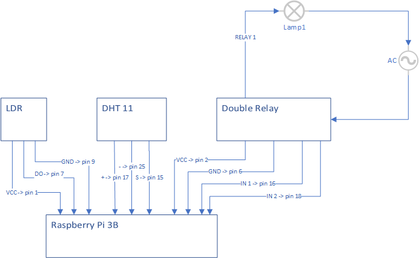

This program controls lamps for home plants. If the lightness is not enough for plants, the computer will turn on the light in a defined time range. This program is dedicated to Raspberry Pi 3B.

Connection schema:
